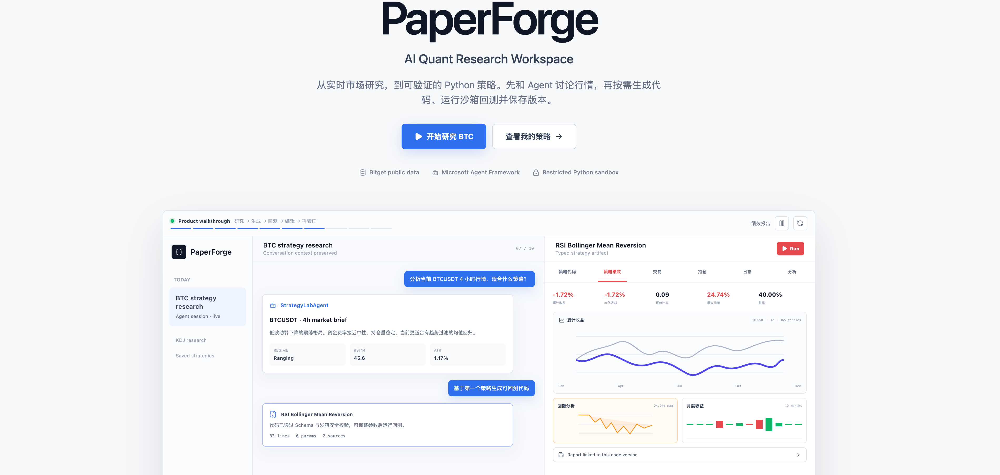
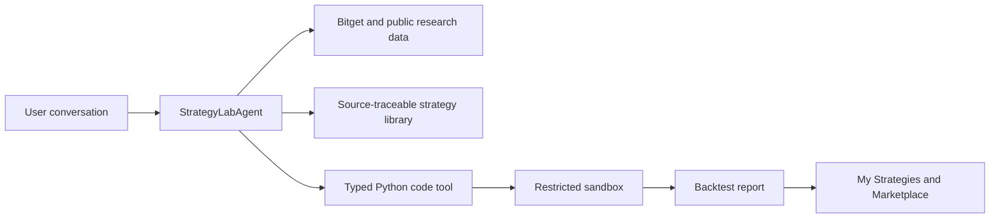

# PaperForge

**AI Quant Research Workspace for the Bitget AI Hackathon 2026**

PaperForge turns a market question into an evidence-backed, executable strategy. A user can discuss current crypto conditions with an Agent, inspect the data and strategy references it used, generate typed Python code on demand, run a restricted sandbox backtest, and save or share the result.



> Research and sandbox use only. PaperForge does not place live orders.

## What to Demonstrate

1. **Research with live evidence**: the Agent selects Bitget market, derivatives, technical, CMC and on-chain tools according to the question.
2. **Strategy references**: recommendations are grounded in source-traceable strategy cards instead of an invisible template.
3. **Typed code generation**: generated Python includes editable parameters and a normalized artifact schema.
4. **Reproducible backtesting**: code runs in a restricted Python sandbox and produces returns, drawdown, trades, positions and logs.
5. **Strategy assets**: a validated result can be saved to My Strategies and published to the Strategy Marketplace.

## Architecture



The conversational runtime uses **Microsoft Agent Framework** as an on-demand Agent tool loop. It is not a fixed workflow: a research question may end as an answer, while code generation and backtesting are invoked only when the user requests them.

## Tech Stack

- Next.js 16, React 19, TypeScript 6 and Tailwind CSS 4
- Python 3.11+ with Microsoft Agent Framework and Pydantic
- SQLite for sessions, artifacts, saved strategies and strategy references
- Bitget MCP Server plus Bitget public market APIs
- DashScope or another OpenAI-compatible LLM provider
- Monaco Editor and Recharts

## Quick Start

### 1. Prerequisites

- Node.js 20.19+, 22.13+, or 24+
- npm
- [uv](https://docs.astral.sh/uv/)
- macOS, Linux, or WSL

### 2. Install dependencies

Run these commands from the repository root:

```bash
npm install
uv --cache-dir .uv-cache sync --project python_backend --frozen
```

`uv` creates the isolated Python environment at `python_backend/.venv`.

Python dependencies are declared in `python_backend/pyproject.toml` and pinned by
`python_backend/uv.lock`; `uv sync --frozen` is the supported installation path.
Python uses the standard-library `sqlite3` module, while the Next.js server uses
the separately declared `better-sqlite3` package from `package.json`.

### 3. Configure the environment

```bash
cp .env.example .env.local
```

For a working Agent demo, configure at least one LLM provider. The default configuration uses DashScope:

```dotenv
LLM_PROVIDER=dashscope
DASHSCOPE_API_KEY=your-dashscope-api-key
DASHSCOPE_BASE_URL=https://dashscope.aliyuncs.com/compatible-mode/v1
DASHSCOPE_MODEL=deepseek-v4-pro
STRATEGY_LAB_CODE_MODEL=kimi-k2.7-code
```

Notes:

- Public Bitget ticker, candles, funding rate, open interest and order-book data do **not** require Bitget credentials.
- `CMC_API_KEY` is optional; without it PaperForge uses rate-limited keyless endpoints.
- Private Bitget credentials are optional and remain read-only.
- See [.env.example](.env.example) for every supported variable and timeout.

### 4. Start both services

Open two terminals at the repository root.

Terminal 1, Python Agent Runtime:

```bash
npm run backend:dev
```

Terminal 2, Next.js application:

```bash
npm run dev
```

Open [http://127.0.0.1:3000](http://127.0.0.1:3000).

### 5. Verify the backend

```bash
curl http://127.0.0.1:8765/health
```

A healthy runtime returns:

```json
{"ok": true, "service": "paperforge-python-backend"}
```

Strategy Lab requests are proxied from Next.js to this service through `PAPERFORGE_PY_BACKEND_URL`.

## Suggested Judge Walkthrough

Open [Strategy Lab](http://127.0.0.1:3000/strategy-lab) and try this sequence:

1. Research the market:

   ```text
   分析当前 BTCUSDT 的 4 小时行情，结合技术指标、资金费率、持仓量和订单簿判断市场状态，暂时不要生成代码。
   ```

2. Request grounded recommendations:

   ```text
   基于上面的行情，从策略库推荐两个策略，并说明匹配理由、风险和参考来源。
   ```

3. Generate an executable artifact:

   ```text
   基于第一个策略生成可回测的 Python 代码。
   ```

4. Open the code artifact, inspect or edit its parameters, and click **运行策略**.
5. Review performance, trades, positions, run logs and analysis suggestions.
6. Click **保存策略**, then open **我的策略** and optionally publish it to **策略广场**.

The conversation keeps context across these turns, so the final code should reflect the earlier market research and selected strategy reference.

## Main Pages

| Page | Purpose |
| --- | --- |
| `/` | Hackathon overview and animated product walkthrough |
| `/strategy-lab` | Agent research, code generation and sandbox backtesting |
| `/strategies` | Saved private strategy assets |
| `/marketplace` | Publicly shared strategies |

## Data and Persistence

- Local application data is stored in `.paperforge/platform.sqlite` by default.
- The database is created and seeded automatically on first use.
- Set `PAPERFORGE_DB_PATH` to use another SQLite location.
- Sessions preserve messages, tool traces, code artifacts and backtest reports.

## Useful Commands

```bash
# Start the frontend
npm run dev

# Start the Python backend
npm run backend:dev

# Run the Python CLI demo
npm run agent:demo

# Frontend checks
npm run lint
npm run typecheck

# Production build
npm run build
```

## Troubleshooting

### `python_backend/.venv/bin/python` not found

Create the backend environment again:

```bash
uv --cache-dir .uv-cache sync --project python_backend --frozen
```

### Frontend reports `ECONNREFUSED 127.0.0.1:8765`

The Python service is not running. Start it with:

```bash
npm run backend:dev
```

### Agent request times out or reports a model error

Check `DASHSCOPE_API_KEY`, the selected model quota, and the provider URL in `.env.local`. You can increase `STRATEGY_LAB_LLM_TIMEOUT_SEC` and keep `STRATEGY_LAB_PROXY_TIMEOUT_MS` slightly higher.

### Bitget MCP cannot start

Run `npm install` and confirm `node_modules/.bin/bitget-mcp-server` exists. `BITGET_MCP_COMMAND` can point to another installed executable when needed.

## Safety Boundaries

- Bitget integration is configured as read-only.
- The research Agent only exposes an allowlist of public market tools.
- Generated strategy code runs in a restricted local sandbox.
- Backtests and risk analysis are research evidence, not investment advice.
