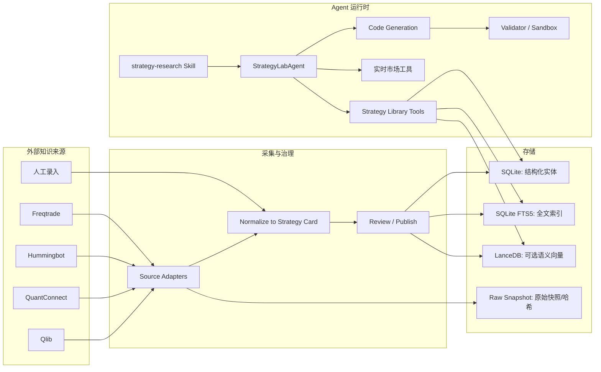
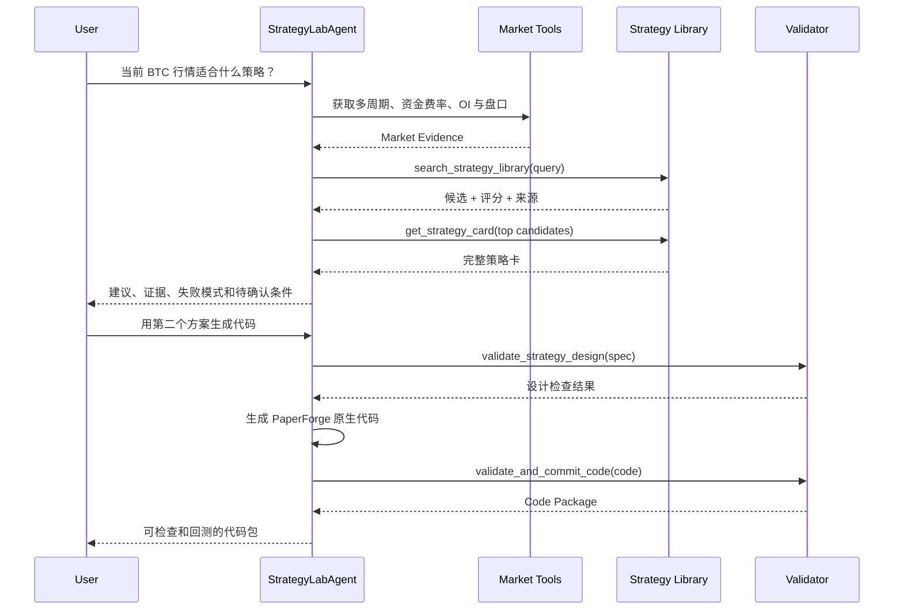

# PaperForge 策略知识库技术方案

状态：讨论稿  
日期：2026-06-20  
范围：Strategy Lab 的策略研究、检索、比较、代码生成与验证能力

## 1. 背景

当前 Strategy Lab 已经采用 Microsoft Agent Framework 的单 Agent 工具循环。Agent 可以读取 Skill、获取 Bitget 行情和衍生品数据、获取 CMC/Coin Metrics/mempool 数据、生成策略代码并执行沙箱回测。

目前策略选择能力仍主要来自模型自身知识和代码内置的少量候选规则。它存在几个问题：

- 策略来源不可追溯，用户无法知道建议依据来自哪里。
- 候选策略数量有限，做市、套利、组合和机器学习策略覆盖不足。
- 模型容易只根据名称或文本相似度选择策略，没有系统检查市场状态、数据条件和执行条件。
- 外部策略代码属于不同框架，不能直接复制到 PaperForge 沙箱执行。
- 缺少统一的失败模式、验证要求、许可证和版本记录。

本方案引入“策略知识库”。外部来源提供研究知识和参考实现，PaperForge 负责标准化、检索、解释、代码生成和验证。

## 2. 目标

### 2.1 产品目标

- Agent 可以先与用户讨论市场和策略，不必立即生成代码。
- Agent 可以根据实时行情、市场结构、可用数据和用户约束检索候选策略。
- 每个推荐都能说明来源、适用条件、失败模式和所需验证。
- 用户明确要求后，模型根据策略知识生成 PaperForge 原生代码，而不是返回固定模板。
- 策略知识库可以持续同步公开来源，并允许在管理页面人工审核、编辑和停用。

### 2.2 非目标

- 不直接运行 Freqtrade、Hummingbot、LEAN 或 Qlib 的外部代码。
- 不宣称公开策略具有可持续收益。
- 不把向量相似度作为最终策略决策。
- 第一阶段不做自动实盘交易。
- 第一阶段不抓取任意博客、论坛或未经审核的 GitHub 仓库。

## 3. 核心原则

1. **知识与执行分离**：外部来源用于研究，执行代码始终生成并验证为 PaperForge 沙箱契约。
2. **结构化条件优先**：市场、周期、数据要求和风险约束先进行确定性过滤。
3. **混合检索**：全文、字段、向量和规则评分共同工作，向量只负责补充召回。
4. **来源可追溯**：每条策略知识必须保留原始链接、版本、许可证和采集时间。
5. **证据优先**：建议必须引用实时市场工具输出和策略来源，不能仅凭模型记忆。
6. **人工可治理**：导入内容先进入草稿或待审核状态，管理员可以发布、停用和覆盖字段。
7. **渐进式接入**：先建立 25 至 50 张高质量策略卡，再扩展规模和语义检索。

## 4. 来源全景

来源分为三类：策略知识、验证与执行参考、实时研究数据。三者不能混为同一种“数据源”。

### 4.1 策略知识来源

| 来源 | 优先级 | 主要价值 | 接入方式 | 第一阶段范围 |
| --- | --- | --- | --- | --- |
| [Freqtrade](https://docs.freqtrade.io/en/stable/strategy-customization/) | P0 | 加密货币方向性策略、指标组合、风险与偏差检查 | 文档和官方策略仓库适配器 | 趋势、突破、均值回归、保护机制 |
| [Hummingbot Controllers](https://hummingbot.org/strategies/v2-strategies/controllers/) | P0 | 做市、网格、套利、跨市场和执行控制器 | 官方文档适配器 | directional、market making、arbitrage、grid |
| [QuantConnect Strategy Library](https://www.quantconnect.com/docs/v2/writing-algorithms/strategy-library) | P0 | 学术策略思想、组合策略和研究教程 | 官方文档适配器 | 动量、均值回归、Dual Thrust、配对交易 |
| [Microsoft Qlib](https://github.com/microsoft/qlib) | P1 | Alpha158/360、模型库、机器学习研究流程 | 官方仓库和文档适配器 | 仅保存模型/特征知识，暂不执行 |
| PaperForge 人工录入 | P0 | 项目自有知识、用户审核后的策略说明 | 管理页面/API | 支持创建、编辑、发布和停用 |

说明：

- Freqtrade、Hummingbot 和 QuantConnect 是第一阶段的主要知识来源。
- Qlib 适合第二阶段机器学习研究，不应阻塞传统策略知识库上线。
- 每个适配器只读取允许公开使用的文档与参考实现；许可证不明确的代码不入库，只保留链接和摘要。

### 4.2 验证与执行参考

| 来源 | 角色 | 是否进入运行时 |
| --- | --- | --- |
| [Freqtrade Lookahead Analysis](https://docs.freqtrade.io/en/stable/lookahead-analysis/) | 前视偏差规则和常见错误知识 | 规则进入 Validator，框架不进入运行时 |
| [VectorBT](https://vectorbt.dev/) | 参数扫描、跨时期比较和敏感性分析 | P1 可作为 Python 验证工具接入 |
| [NautilusTrader](https://nautilustrader.io/docs/latest/getting_started/) | 事件驱动执行和回测/实盘一致性参考 | 当前只作为架构参考，暂不安装 |
| PaperForge Sandbox | 当前唯一策略执行契约 | 保持为第一阶段执行引擎 |

### 4.3 实时研究数据来源

这些数据不保存为策略卡，而是在每次研究时作为当前证据参与候选策略评分。

| 来源 | 当前状态 | 数据能力 | 典型用途 |
| --- | --- | --- | --- |
| Bitget MCP | 已接入 | 现货/合约 ticker、K 线、盘口、成交、资金费率、OI、合约信息 | 趋势、波动率、拥挤度、流动性和基差研究 |
| CoinMarketCap | 已接入 | 市值、FDV、供应量、排名、全局市场、Dominance、恐惧贪婪 | 资产画像和市场风险偏好 |
| Coin Metrics Community | 已接入 | 活跃地址、交易数、转账额、手续费、供应、MVRV、NVT、Hash Rate | 链上活动和估值状态 |
| mempool.space | 已接入 | BTC mempool、推荐费率和网络拥堵 | BTC 网络状态与事件风险 |
| 新闻/事件源 | 未接入 | 新闻、公告、宏观事件和情绪 | 事件驱动和消息面研究 |

新闻源需单独设计，不能把 CMC 或交易所行情误称为新闻。候选方向包括官方项目公告、交易所公告、GDELT、CryptoPanic 等；其授权、速率和可靠性需要单独评审。

### 4.4 后续候选来源

以下来源保留为扩展项，不纳入第一阶段承诺：

- CoinGecko：资产元数据和市场覆盖补充。
- DefiLlama：TVL、协议收入、稳定币和 DeFi 流动性。
- Glassnode/CryptoQuant：更丰富链上与交易所流量，通常需要 API Key。
- Deribit/Coinglass：期权和清算数据，需单独评估授权。
- arXiv/SSRN：论文证据，必须经过人工筛选，不能自动视为可靠策略。

## 5. 总体架构



## 6. 数据模型

策略知识库与“我的策略”是两个不同的领域：

- `saved_strategy` / `strategy_version`：用户创建、回测和保存的可执行策略。
- `strategy_card`：来自外部知识源或人工整理的参考策略。

两者不能复用同一实体，以免把公共知识、用户代码和市场发布状态混淆。

### 6.1 strategy_card

```json
{
  "id": "strategy-card-kdj-regime-reversal",
  "name": "KDJ Regime-Aware Reversal",
  "family": "mean_reversion",
  "summary": "在震荡或弱趋势市场中使用 KDJ 极值反转，并通过趋势与波动过滤。",
  "thesis": "...",
  "markets": ["crypto_spot", "crypto_perpetual"],
  "timeframes": ["1h", "4h", "1d"],
  "regimes": ["ranging", "weak_trend"],
  "directions": ["long", "short"],
  "requiredData": ["ohlcv"],
  "optionalData": ["funding_rate", "open_interest"],
  "signals": {
    "entry": "...",
    "exit": "..."
  },
  "riskControls": ["atr_stop", "max_holding_period", "position_cap"],
  "parameters": [],
  "failureModes": ["strong_trend", "volatility_expansion"],
  "validationRequirements": ["walk_forward", "lookahead_check", "fee_sensitivity"],
  "status": "published",
  "qualityScore": 0.82,
  "createdAt": "...",
  "updatedAt": "..."
}
```

建议的 `family` 初始枚举：

- `trend_following`
- `breakout`
- `mean_reversion`
- `momentum`
- `market_making`
- `grid`
- `statistical_arbitrage`
- `cross_exchange_arbitrage`
- `carry_basis_funding`
- `volatility`
- `onchain_event`
- `portfolio_allocation`
- `machine_learning_alpha`

### 6.2 strategy_source

记录一张策略卡的一个来源。同一策略卡可以同时引用多个来源。

关键字段：

- `strategyCardId`
- `provider`：freqtrade / hummingbot / quantconnect / qlib / manual
- `sourceType`：documentation / repository / paper / manual
- `sourceUrl`
- `sourceVersion` 或 commit SHA
- `title`
- `authors`
- `license`
- `retrievedAt`
- `contentHash`
- `rawSnapshotPath`
- `attributionRequired`

### 6.3 strategy_implementation

保存不同框架的参考实现元数据，不表示该代码可直接执行。

关键字段：

- `strategyCardId`
- `framework`
- `language`
- `sourceId`
- `codeReference`
- `configSchema`
- `compatibilityStatus`：reference_only / adaptable / unsupported
- `notes`

### 6.4 strategy_validation

记录知识卡或生成策略的验证证据：

- 前视偏差检查
- 数据泄漏检查
- 费用、滑点和资金费率敏感性
- 参数稳定性
- 样本内/样本外
- Walk-forward
- 市场和周期覆盖
- 验证时间、数据源与结果摘要

### 6.5 strategy_embedding

向量不是主数据。它只保存可重建索引：

- `strategyCardId`
- `embeddingModel`
- `embeddingVersion`
- `contentHash`
- `vector`
- `indexedAt`

用于 embedding 的文本由名称、摘要、理论、适用行情、数据要求和失败模式拼接产生，不嵌入原始大段代码。

## 7. 检索与排序

### 7.1 为什么不能只用向量

策略选择包含大量硬约束。一个“语义很像”的策略可能需要当前没有的订单簿、期权或链上数据，也可能不支持做空，或者不适合用户要求的周期。

因此第一阶段以结构化检索为主，向量检索为可选补充。

### 7.2 查询标准化

Agent 或查询解析器将自然语言转换成 `StrategySearchQuery`：

```json
{
  "market": "crypto_perpetual",
  "symbol": "BTCUSDT",
  "timeframe": "4h",
  "regime": "ranging",
  "trend": "down",
  "volatility": "low",
  "availableData": ["ohlcv", "funding_rate", "open_interest", "orderbook"],
  "direction": "both",
  "riskTolerance": "balanced",
  "keywords": ["KDJ", "reversal"]
}
```

### 7.3 检索流水线

1. **状态过滤**：只检索 `published` 且未过期的知识卡。
2. **硬条件过滤**：市场、方向、周期、所需数据和执行兼容性。
3. **FTS5 召回**：名称、别名、指标、策略族和来源文本。
4. **向量补充召回**：理解“低位反弹”“拥挤多头回撤”等语义描述。
5. **确定性评分**：按照行情、数据、周期、风险和来源质量评分。
6. **LLM 重排**：只对前 5 至 10 个候选做解释性比较，不允许引入未召回策略。
7. **证据输出**：返回命中原因、不匹配项、失败模式和来源。

### 7.4 建议评分

初始权重：

| 因素 | 权重 |
| --- | ---: |
| 市场状态匹配 | 30% |
| 数据可用性 | 20% |
| 周期与交易方向 | 15% |
| FTS/关键词匹配 | 15% |
| 风险约束匹配 | 10% |
| 来源质量与验证状态 | 10% |

向量相似度在第一阶段不单独进入最终评分，只用于补充 FTS 未召回的候选。进入第二阶段后，可以在离线评测通过的前提下分配不超过 10% 至 15% 权重。

### 7.5 无向量的第一阶段

当策略卡数量少于约 100 张时，采用 SQLite 字段过滤 + FTS5 + 规则评分已经足够。此时可以完全不生成 embedding，避免过早引入检索不稳定性和额外成本。

## 8. Agent Skill 与 Tools

### 8.1 Skill

策略条目不做成独立 Skill。第一阶段增加一个通用 Skill：

- `strategy-lab-strategy-research`

它定义：

- 何时先获取实时市场证据。
- 何时检索策略知识库。
- 如何比较候选策略。
- 如何披露失败模式和缺失数据。
- 何时必须停止在研究阶段。
- 只有用户明确要求时才能进入代码生成。

现有 `strategy-lab-strategy-design` 可以迁移或合并到该 Skill，避免职责重叠。

### 8.2 Tools

#### `search_strategy_library`

输入结构化查询，返回候选摘要、评分分解和命中原因。

#### `get_strategy_card`

读取完整策略卡、来源、失败模式、参数和验证要求。

#### `compare_strategy_cards`

在给定实时市场快照下比较 2 至 5 个候选；比较逻辑应主要确定性实现。

#### `validate_strategy_design`

在生成代码前检查：

- 所需数据是否可用。
- 信号是否存在明显前视偏差。
- 是否包含退出与风控。
- 费用、滑点、资金费率和清算假设是否缺失。
- 是否要求 PaperForge 当前不支持的执行模型。

#### 管理工具

- `sync_strategy_source`
- `review_strategy_card`
- `reindex_strategy_library`

管理工具不暴露给普通 StrategyLabAgent，只供后台任务或管理员 API 使用。

## 9. Agent 运行流程



## 10. 来源采集与治理

### 10.1 采集模式

第一阶段不做高频爬虫。采用显式同步任务：

1. 拉取官方索引页或仓库固定版本。
2. 保存来源元数据、内容哈希和原始快照。
3. 解析为来源候选。
4. 通过确定性映射和 LLM 辅助生成策略卡草稿。
5. 人工审核后发布。

LLM 只能辅助摘要和字段提取，不能自动判定“策略有效”。

### 10.2 去重与合并

同一理论可能出现在多个来源，不能仅按名称去重。建议使用：

- 规范化 family。
- 核心信号指纹。
- requiredData 和 regime 组合。
- 来源链接和内容哈希。
- 人工确认合并。

合并后保留多个 `strategy_source`，不覆盖原始出处。

### 10.3 许可证与归属

- 每个来源必须记录许可证和归属要求。
- 许可证未知时，只保存公开链接、简短事实摘要和人工撰写的策略说明。
- 不把外部代码直接作为模型输出模板。
- 用户发布到策略市场的代码不能暗示为外部项目官方策略。

### 10.4 更新与失效

- 来源发生变化时创建新的 source revision。
- 策略卡人工修改保留 revision 记录。
- 原始链接失效、许可证变化或内容被撤回时，将卡片标记为 `needs_review`。
- embedding 必须由 `contentHash` 驱动重建，避免旧向量继续参与检索。

## 11. 存储选择

### 11.1 SQLite

继续使用 `.paperforge/platform.sqlite` 作为结构化事实源，原因：

- 当前项目已经有通用实体存储和 API。
- 第一阶段数据量小。
- SQLite FTS5 足以支持可解释的全文检索。
- 本地 Hackathon 环境部署简单。

第一阶段可以沿用当前 JSON entity store，但建议为 FTS5 建立独立索引表，而不是在 JSON 字符串上做模糊扫描。

### 11.2 LanceDB

当前项目已安装 LanceDB，但现有 MemoryStore 尚未实现真正的 embedding 检索。策略库使用 LanceDB 时应建立独立表，不能复用 `memories` 表。

启用条件：

- 策略卡达到一定规模或 FTS 漏召回问题可复现。
- 已选择固定 embedding 模型和版本。
- 已建立离线检索评测集。
- 向量检索关闭时系统仍能正常工作。

## 12. API 设计

### 12.1 Agent 内部 API

- `POST /strategy-library/search`
- `GET /strategy-library/cards/{cardId}`
- `POST /strategy-library/compare`
- `POST /strategy-library/validate-design`

### 12.2 管理 API

- `GET /strategy-library/cards`
- `POST /strategy-library/cards`
- `PATCH /strategy-library/cards/{cardId}`
- `POST /strategy-library/cards/{cardId}/publish`
- `POST /strategy-library/sources/sync`
- `GET /strategy-library/sources/runs`

普通 Strategy Lab 页面只读取 `published` 卡片；管理 API 后续需要最小权限控制。

## 13. 页面规划

策略知识库不与“我的策略”混在一起。

### 13.1 策略库页面

建议路由：`/strategy-library`

主要内容：

- 策略族、市场、周期、数据要求和来源筛选。
- 策略卡列表。
- 适用行情、失败模式和验证状态。
- 来源与许可证。
- “在 Strategy Lab 中研究”命令。

### 13.2 管理页面

建议后续路由：`/strategy-library/manage`

- 草稿/待审核/已发布/需复审状态。
- 来源同步记录。
- 字段编辑与来源合并。
- FTS/向量索引状态。

## 14. 实施阶段

### Phase 0：领域模型与基线

- 定义 Pydantic 模型和数据库实体。
- 增加 SQLite FTS5 索引。
- 建立 20 个代表性查询的离线评测集。
- 保留当前 `compare_strategy_candidates` 作为回归基线。

### Phase 1：首批知识库

- 实现 Freqtrade、Hummingbot、QuantConnect 三个适配器。
- 人工审核 25 至 50 张策略卡。
- 实现四个 Agent Tools。
- 增加策略研究 Skill。
- Agent 推荐中展示来源、匹配原因与失败模式。
- 不启用向量检索。

建议首批覆盖：

- 趋势与突破：5 至 7 张。
- 均值回归：4 至 6 张。
- 动量与多周期：3 至 4 张。
- 资金费率/基差：3 至 4 张。
- 做市与网格：3 至 4 张。
- 配对与统计套利：3 至 4 张。
- 链上/事件状态：2 至 3 张。
- 组合与风险配置：2 至 3 张。

### Phase 2：验证增强

- 接入 VectorBT 或扩展现有回测引擎进行参数敏感性分析。
- 增加 Walk-forward、样本外、费用和资金费率敏感性。
- 将 Freqtrade 前视偏差规则落为静态检查和测试用例。

### Phase 3：语义检索

- 为 LanceDB 建立独立策略索引。
- 选择并固定 embedding 模型。
- 用离线查询集评估 Recall@K、Precision@K 和不合格候选率。
- 仅在指标优于 FTS 基线时启用混合召回。

### Phase 4：高级来源

- 接入 Qlib 模型与特征知识。
- 评估新闻、DeFi、期权和清算数据源。
- 根据执行需求评估 NautilusTrader，而不是默认替换当前沙箱。

## 15. 质量与验收

### 15.1 检索评测

建立人工标注查询，例如：

- “BTC 4h 震荡偏空，资金费率为正，适合什么低频策略？”
- “没有订单簿数据时能否做高频做市？”
- “寻找只需要 OHLCV、支持做空的趋势策略。”
- “当前 OI 上升但价格下跌，有哪些风险较低的候选？”

指标：

- `Recall@5`
- `Precision@5`
- 硬约束违规率
- 无来源推荐率
- 缺失失败模式率
- Agent 引入库外策略率

硬约束违规和无来源推荐应为 0。

### 15.2 工程测试

- 适配器解析 fixture 测试，不依赖实时站点。
- 内容哈希与幂等同步测试。
- 来源 revision 和卡片 revision 测试。
- FTS 查询、过滤和评分单元测试。
- Tool schema 与 Agent 调用集成测试。
- 向量功能关闭时的降级测试。
- 外部来源不可用时不得阻塞已有 Strategy Lab。

## 16. 风险

| 风险 | 缓解措施 |
| --- | --- |
| 公开策略被误认为可靠 Alpha | 明确标注“参考知识”，展示验证状态，不导入来源收益结论 |
| 向量误召回 | 硬过滤优先、低权重、离线评测、可关闭 |
| 外部代码许可证问题 | 保存许可证与归属，默认不复制代码 |
| 来源结构变化导致解析失败 | fixture 测试、内容哈希、同步任务告警 |
| 策略重复或概念冲突 | 多来源模型、信号指纹、人工合并 |
| LLM 编造不存在的来源 | Tool 返回来源 ID，响应只能引用 Tool 结果 |
| 回测过拟合 | Walk-forward、样本外和参数敏感性作为验证要求 |
| 数据能力不足 | requiredData 硬过滤并披露缺失数据 |

## 17. 待讨论决策

1. 第一阶段首批策略卡数量采用 30 张还是 50 张。
2. 策略卡是否必须人工审核后才能进入 Agent 检索。
3. Freqtrade/Hummingbot 适配器第一版读取固定快照还是允许手动在线同步。
4. 策略库页面是否在 Hackathon 版本中公开，还是只作为 Agent 内部能力。
5. VectorBT 是第一阶段同时接入，还是先复用现有沙箱完成知识检索闭环。
6. 新闻源是否与策略知识库并行建设，还是在策略库稳定后推进。

## 18. 建议结论

第一阶段采用以下组合：

- SQLite 保存结构化策略卡、来源与验证记录。
- SQLite FTS5 提供全文检索。
- Freqtrade、Hummingbot、QuantConnect 作为首批知识来源。
- Bitget MCP、CMC、Coin Metrics、mempool 继续提供实时研究证据。
- Strategy Skill 规定研究流程，Strategy Tools 提供确定性检索和比较。
- 模型根据知识卡生成 PaperForge 原生代码，外部代码不直接执行。
- LanceDB 暂不参与最终排序，等离线评测证明有增益后再启用。

这条路径能充分利用现有技术栈，同时控制向量误召回、框架耦合和公开代码质量风险。

## 19. 当前实施状态（2026-06-20）

已完成策略依据最小闭环：

1. `StrategyCard + StrategySource + StrategyValidation` 已持久化到 SQLite。
2. FTS5 与结构化硬过滤负责召回，确定性评分负责排序，向量检索保持关闭。
3. Agent 已具备搜索卡片、读取详情、比较候选和生成前校验四类策略知识工具。
4. 代码包、回测快照、保存策略版本和公开版本均保留 `strategyReferences`，可追溯到来源标题与 URL。
5. 当前 15 个 Python 测试覆盖检索、数据硬过滤、候选比较、校验持久化、来源传递，以及代码包进入沙箱回测的主链路。

### Hackathon 实施裁剪

为保证演示链路稳定，Hackathon 版本不再实施来源固定快照同步、内容哈希、revision、人工审核入口和策略库管理页面。当前 12 张人工整理且带来源的策略卡作为只读产品能力，足以支撑模型引用、推荐和代码生成。

演示版本只要求跑通：实时研究数据 -> 固定策略库检索 -> 策略建议 -> 大模型生成 PaperForge 原生代码 -> 沙箱回测。策略搜索一次请求只调用一次并复用缓存；候选比较仅在用户明确比较多个方案时使用。向量检索继续关闭，外部框架代码仍不进入运行时。

自动同步、审核治理、参数敏感性、样本外与 Walk-forward 作为 Hackathon 后路线，不再进入当前关键路径。
