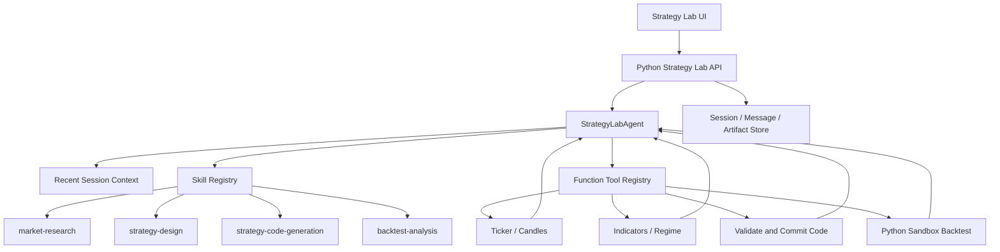
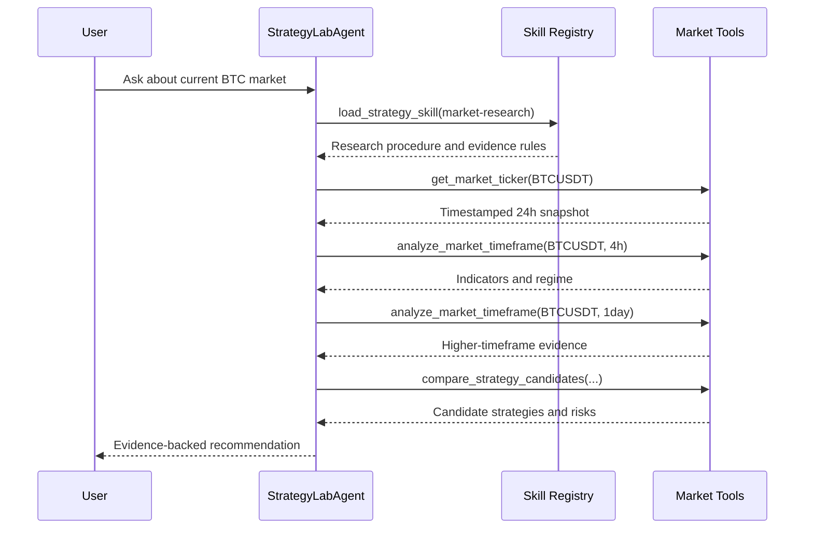

# Strategy Lab Single-Agent Architecture

Status: Approved for implementation  
Date: 2026-06-19

## 1. Goal

Replace the fixed Strategy Lab `Router -> Planner -> Code Agent -> Validator` workflow with one conversational `StrategyLabAgent` driven by reusable skills and function tools.

The agent must support a natural research-first conversation:

1. Discuss the market and strategy ideas without generating code.
2. Retrieve real market evidence when the user asks about current conditions.
3. Generate code only after an explicit request.
4. Validate code before creating an artifact.
5. Run a backtest only after an explicit request or button action.

## 2. Target Architecture

Microsoft Agent Framework `Agent.run()` owns the model/tool loop. `WorkflowBuilder` is not used in the conversational Strategy Lab path.

## 3. Responsibilities

### StrategyLabAgent

- Receives the current user message and compact recent session context.
- Discovers and loads a relevant skill before doing domain work.
- Chooses tools based on the conversation instead of a fixed graph.
- Continues observing tool results until it has enough evidence.
- Returns a conversational answer plus optional typed outputs.
- Never claims access to current market data unless a market tool succeeded.

### Skills

Skills are procedural instructions, not executable capabilities.

Each skill follows the `SKILL.md` convention and defines:

- When the skill should be used.
- Required evidence.
- Allowed tools.
- Output expectations.
- Safety and stopping rules.

Initial Strategy Lab skills:

| Skill | Purpose |
| --- | --- |
| `strategy-lab-market-research` | Analyze current market state with real ticker and candle evidence. |
| `strategy-lab-strategy-design` | Compare strategy styles against an observed market regime. |
| `strategy-lab-code-generation` | Generate sandbox-compatible Python strategy code only on explicit request. |
| `strategy-lab-backtest-analysis` | Run or explain a sandbox backtest only on explicit request. |

### Tools

Tools expose deterministic operations and external data:

| Tool | Side effect | Notes |
| --- | --- | --- |
| `list_strategy_skills` | No | Lists available Strategy Lab skills. |
| `load_strategy_skill` | No | Returns the selected `SKILL.md` instructions. |
| `get_market_ticker` | No | Reads public Bitget ticker data. |
| `analyze_market_timeframe` | No | Reads candles and calculates EMA, RSI, ATR, ADX and regime. |
| `compare_strategy_candidates` | No | Maps observed regime to strategy candidates and risks. |
| `validate_and_commit_code` | Creates pending output | Validates model-generated code and submits a code-package result to the API layer. |
| `run_strategy_backtest` | Runs sandbox | Executes the active strategy in the restricted Python sandbox. |

## 4. Code Generation Boundary

There is no Code sub-agent in the first implementation.

The main `StrategyLabAgent` generates code under the `strategy-lab-code-generation` skill. It must then call `validate_and_commit_code` with the generated code. The tool:

1. Performs AST and forbidden-API checks.
2. Verifies the `Strategy.generate_signals(self, df)` contract.
3. Extracts editable `# @param:` declarations.
4. Returns validation errors to the same agent loop when invalid.
5. Exposes a typed code-package result only when valid.

The API/store layer remains the only component that writes artifacts to the database.

A specialized code-model tool may be added later if single-agent code quality is insufficient. This is an optimization, not part of the initial architecture.

## 5. Research Loop

Example: `当前 BTC 是什么行情，适合什么策略？`

Tool order is selected by the agent and is not encoded as a workflow graph.

## 6. Conversation and Persistence

The existing database remains the source of truth for:

- Sessions
- User and assistant messages
- Code-package artifacts
- Backtest artifacts
- Active artifact selection

Each turn passes a compact recent-message window and active artifact summary to the agent. Tool calls are recorded as `toolTrace` metadata for audit and future UI presentation.

## 7. Safety Rules

- Current-market claims require successful real-data tool output.
- Real-data failures must not fall back to mock data for research answers.
- Code generation requires explicit user intent.
- Backtesting requires explicit user intent or a UI run action.
- Code must pass validation before artifact persistence.
- Strategy code cannot access network, filesystem, processes, environment, or dynamic execution APIs.
- No live order placement tools are exposed.
- Each tool has an invocation limit; one turn has a bounded model/tool loop.

## 8. Compatibility

The frontend and HTTP response shapes remain compatible:

- A normal research turn creates user and assistant messages.
- A successful code turn additionally creates a `code_package` artifact.
- A successful run turn creates or updates a `backtest_run` artifact.
- Agent/tool audit information is stored in artifact metadata or message metadata.

The old Planner/Code workflow may remain temporarily for migration but is removed from the active Strategy Lab request path.

## 9. Implementation Order

1. Add Strategy Lab skill files and a skill loader.
2. Add real market and indicator tools.
3. Build `StrategyLabAgent` with Agent Framework `Agent` and function tools.
4. Add deterministic code validation/commit and sandbox backtest tools.
5. Route all Strategy Lab messages through the single agent.
6. Preserve current database artifacts and frontend API contracts.
7. Verify research, code generation, context inheritance, and backtest paths.

